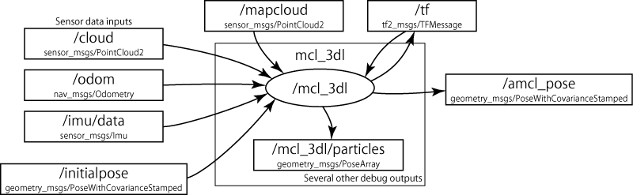
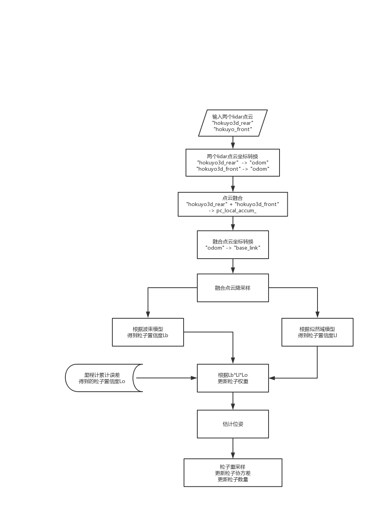

# mcl_3dl 粒子滤波定位代码学习

## 1 算法总览

使用粒子密度和权重表示粒子的概率分布，并从分布中估计机器人姿态。根据激光雷达，IMU，里程计等传感器，实现了粒子滤波中的观测模型，预测模型。并实现了粒子滤波的失效恢复。

## 2.  算法细节

#### a. 观测模型

粒子在当前状态的观测由带有高斯噪声的激光雷达和IMU观测模型获得，并用于对粒子的权重进行更新。

##### 激光观测模型

本算法分别通过以下两种模型，计算每一个粒子的似然：

1. 采用大量随机采样点计算得到的似然域模型。
2. 使用少量的随机采样点计算得到的波束模型。

然后将这两种模型得到的似然相乘得到总的似然，更新粒子的权重。这种更新方法，计算量小，同时有效排除了失配点。

在本算法的实现中，似然域模型的似然是观测点到最近点之间距离的加和。观测点使用了体素滤波和随机采样，最近点搜索采用了chunked kd-tree，以降低计算量。波束模型则是利用射线投影。是测量点个数，是穿过物体的射线条数，是抛弃权重，似然通过计算。

##### 加速度观测模型

机器人位姿的似然通过计算IMU加速度矢量和粒子姿态之间的差，带入高斯分布得到。

#### b.  预测模型

预测当前状态下粒子的分布是通过带高斯噪声的里程计数据获得的。同时使用IMU补偿里程计数据。

里程计模型使用相对运动信息，记录的是机器人内部坐标系下的运动过程，该坐标系和世界坐标的关系未知。尽管如此，但是通过计算t和t-1时刻的相对运动，可以得到机器人在时间内运动的平移和旋转。可以将时间内的运动分解为两个旋转和一个平移。

#### c. 重采样

通过复制权重较大的粒子实现重采样，复制粒子时加入高斯噪声。

## 代码实现

#### a. 程序框架图

图中中间的节点/mcl_3dl是主节点，接受其他节点传来各种消息。每个消息对应一个CALLBACK函数，比如cloud消息对应cbCloud函数，对消息进行处理。各个CALLBACK函数的功能如下：

- cbOdom: 接受里程计数据(odom)，用于更新粒子分布的似然
- cbImu: 接受IMU数据(imu/data)，用于更新粒子权重的先验
- cbMapcloud: 接受地图数据(mapcloud)，用于定位和显示
- cbPosition: 接受位置信息(initialpose)，用于rviz上的手动定位
- cbCloud: 接受当前的激光点云数据(cloud)，融合odom和imu得到的先验和似然，实现粒子滤波的所有过程。

#### b. 程序流程图

cbCloud: 负责粒子滤波的观测，估计和重采样过程。接受点云数据，根据似然域和波束模型计算得到每个粒子的似然值。具体的实现如下：

## 运行问题与解决方案

#### 1 console交替显示map received 和 map reduced

​	这是因为map发布不止一次，每次收到map的消息，都会触发cbMap函数。解决方法是不要使用map publisher，而是直接加载pcd文件。

